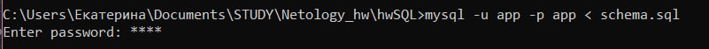

# проект без Docker

## Шаг №1 - Скачать MySQL
1. Установка MySQL с официального сайта (https://dev.mysql.com/downloads/mysql/)
2. Создать БД и пользователя:

```sql
 CREATE DATABASE app;
 CREATE USER 'app'@'localhost' IDENTIFIED BY 'pass';
 GRANT ALL PRIVILEGES ON app.* TO 'app'@'localhost';
 ```

## Шаг №2 - Импорт схемы


## Шаг №3 - Запуск приложения
java -jar app-deadline.jar -P:jdbc.url=jdbc:mysql://localhost:3306/app -P:jdbc.user=app -P:jdbc.password=pass

## Шаг №4 - Запуск тестов
./gradlew test